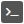

外部 SSH クライアントの呼び出し
=====

- [RHarbor](index.ja.md) トップページに戻る

## 概要

RHarbor では **保存した SSH の接続情報を利用して Tera Term Pro や RLogin などの SSH クライアントを呼び出す** ことができます。

## 外部プログラムの設定

### 設定の追加

[設定] → [外部プログラム] の  ボタンをクリックして、テンプレートを選択します。リストに希望のプログラムがない場合は「自分で入力」をクリックして編集ください。

Tera Term などいくつかのテンプレートでは実行ファイルパスやコマンドライン引数が自動で設定されます。
**実行ファイルパスやコマンドライン引数は手元の環境に合わせて適宜設定してください。**

**コマンドライン引数では `{host}`, `{username}` などのパラメーターが利用できます。**
それぞれ SSH の接続情報で定義したデータで置き換えられます。詳細はコマンドライン引数のヘルプ表示を参照してください。

設定できたら、設定画面右下の  ボタンをクリックして、設定を保存します。

### 標準のテンプレート

標準のテンプレートとして下記の SSH クライアントのものを用意しています。

- OpenSSH (クリップボードに SSH コマンドをコピー, ※パスワード非対応)
- PuTTY
- Tera Term Pro
- RLogin

これ以外のものは適宜カスタマイズしてご利用ください。

### 設定の削除

不要な設定は  ボタンで削除した後、設定を保存することで削除できます。

## 設定した外部プログラムの起動

SSH 接続情報で  を押すと設定した外部プログラムの一覧が表示されます。

**希望のプログラムを選択すると設定した実行ファイルが接続情報とともに呼び出されます。**

外部プログラム設定で「クリップボードにコピー」にチェックが入っている場合はプログラムは起動されず、起動用のコマンド文字列がクリップボードにコピーされます。

## ヒント

### PuTTY の鍵ファイルについて

**RHarbor で利用できる SSH の鍵ファイルは OpenSSH 形式であるため、 [PuTTY](https://www.putty.org/) でそのまま利用することはできません。**

ここでは RHarbor の外部プログラム呼び出し機能を使って PuTTY で接続する方法をご紹介します。

まず、鍵ファイルは [PuTTYgen](https://www.puttygen.com/) (PuTTY に同梱) を利用して PuTTY 形式に変換しておきます。
また、`<OpenSSH の鍵ファイル名>.ppk` にして同じフォルダに配置します。

たとえば OpenSSH 形式の鍵ファイル名が `key.pem` であれば `key.pem.ppk` のようになります。

これでコマンドライン引数の設定で `putty -ssh -i "{keyfile}.ppk"` のように指定すれば PuTTY 形式の鍵ファイルを渡すことができます。

