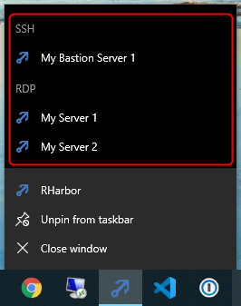
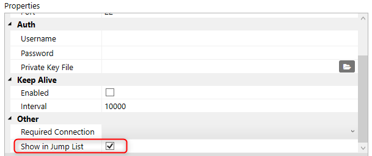
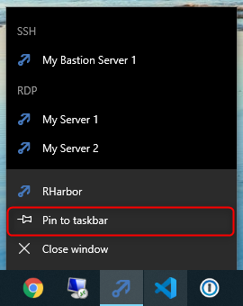

Starting connection from the Windows Jump List
=====

- Go back to [RHarbor](index.md) top page

## Summary

You can easily connect to your frequently-used connections by using the Jump List as below.

## Settings

To show your favorite connection in the Jump List, turn "Show in Jump List" property on in each connection setting.

## How to use

You have two ways below to show the Jump List.

- Right-click on the taskbar icon.
- Press the left-button on the taskbar icon and then drag for the screen center.

Keeping RHarbor icon on the taskbar makes RHarbor experience more handy. All you need to do is "Pin to Taskbar".

## Detail

When you select a connection in the Jump List, RHarbor will behave as below.

- RHarbor has not been run => RHarbor will open and automatically start the connection.
- RHarbor has already run => Start the connection in the existed RHarbor.
