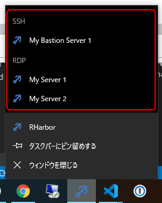
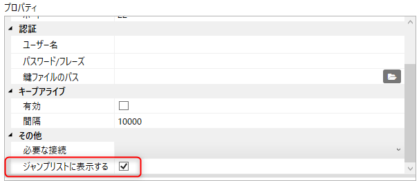
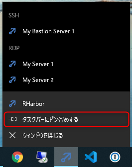

Windows のジャンプリストを使った接続
=====

- [RHarbor](index.ja.md) トップページに戻る

## 概要

RHarbor では Windows ７ 以降に搭載されているタスクバーのジャンプリストから、下図のようによくつかう接続を直接起動することができます。

## 設定方法

ジャンプリストに接続を表示するには、各接続設定の「ジャンプリストに表示」プロパティを有効にします。

## 使い方

ジャンプリストを表示するには、下記の2通りの方法があります。

- タスクバーのアイコン上で右クリックする
- タスクバーのアイコンをマウス左ボタンでデスクトップ内側に向けてドラッグする

ジャンプリストをより便利に利用するためには RHarbor のアイコンを常にタスクバーに表示させるとよいでしょう。タスクバーのアイコンを右クリックして、「タスクバーにピン留めする」を選択するだけです。

## 動作仕様

ジャンプリストから接続を選択すると下記のように動作します。

- RHarbor が起動していないとき → RHarbor が起動して自動的に接続を開始
- すでに RHarbor が起動しているとき → 起動済みの RHarbor で接続を開始
