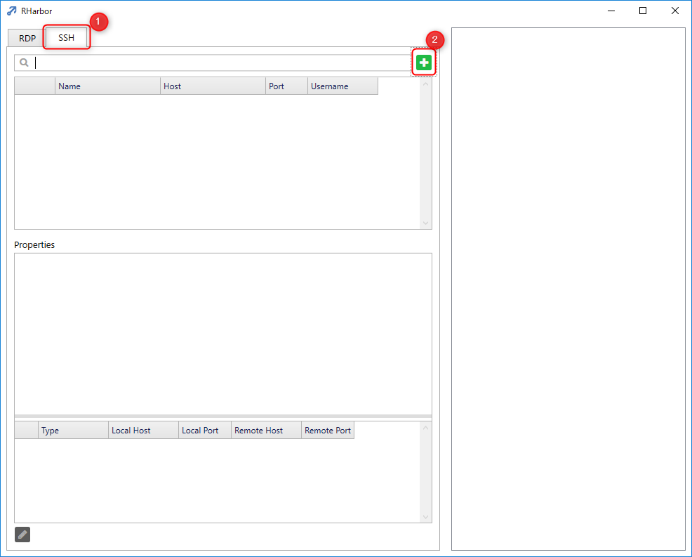
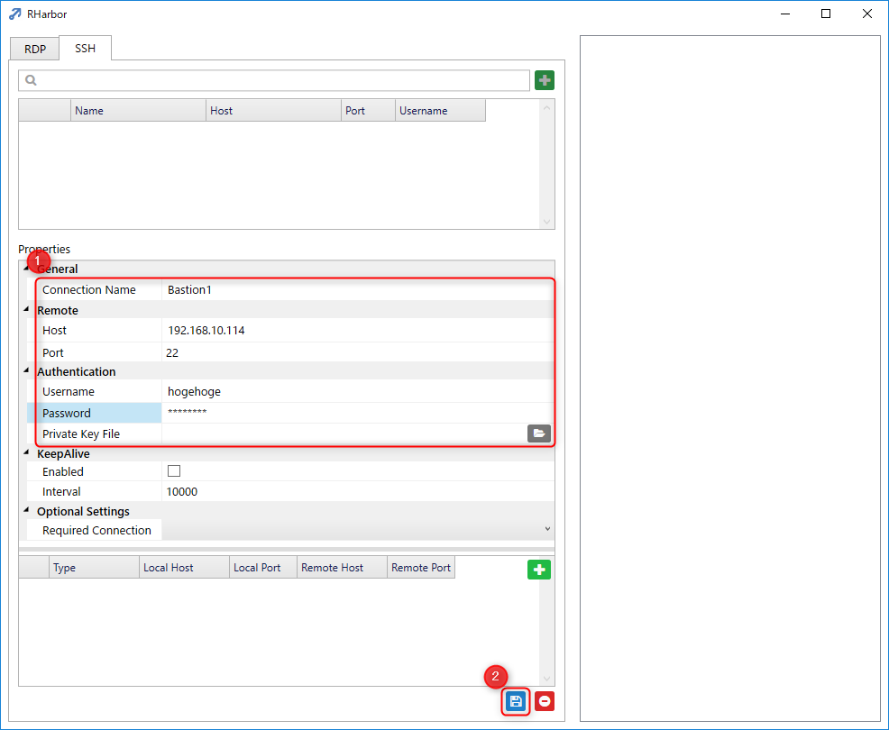
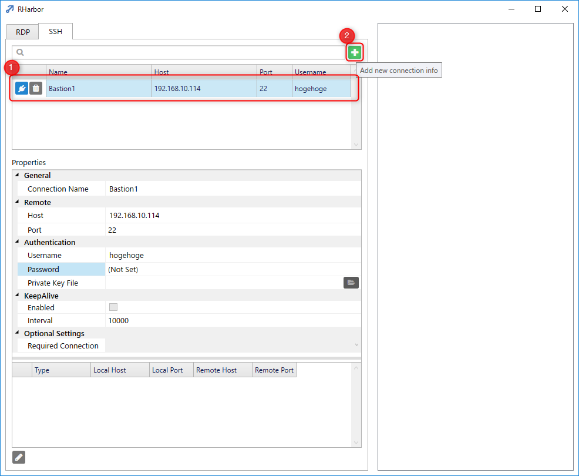
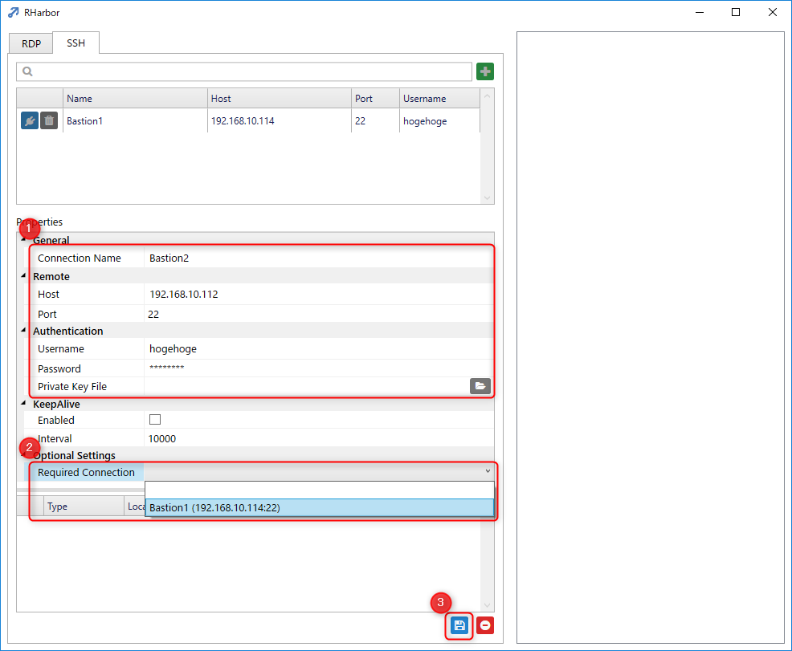
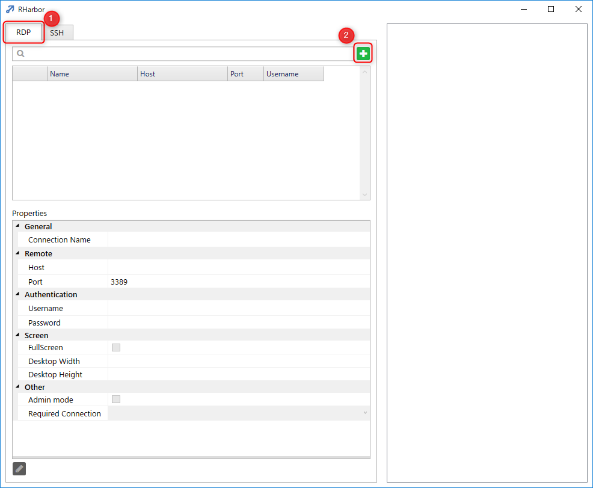
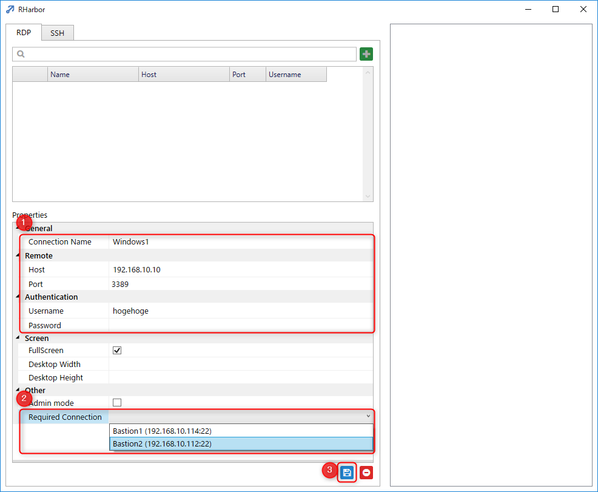
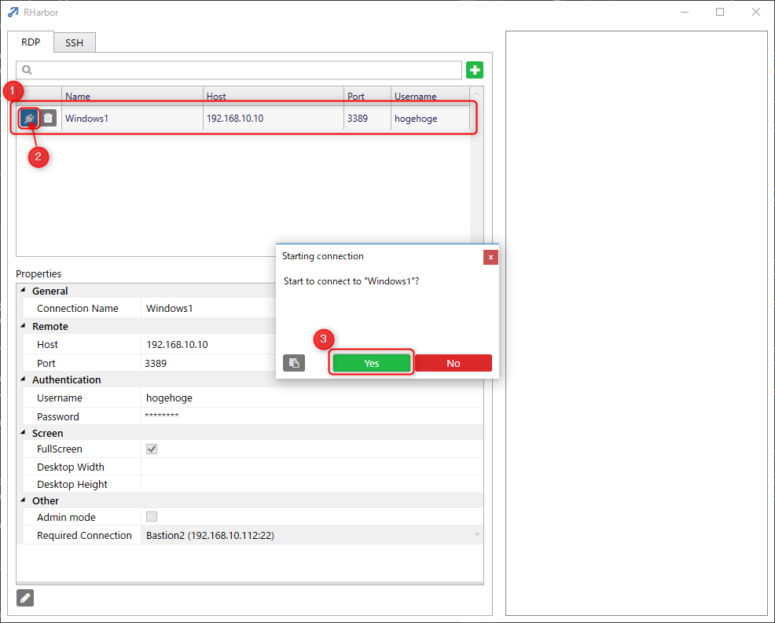
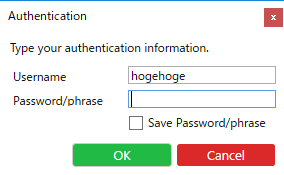
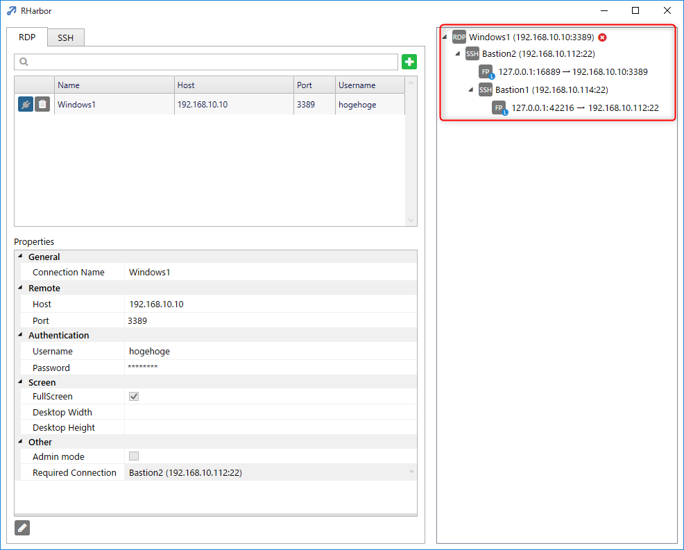

多段 SSH 経由のリモートデスクトップ接続
=====

- [RHarbor](index.ja.md) トップページに戻る

## 概要

RHarbor では複数の SSH 接続をシーケンシャルに接続して、多段 SSH 接続をワンステップで確立することができます。

数の踏み台サーバーを経由して接続する必要がある場合、接続が非常に簡単になります。

また、多段 SSH 接続を設定しておけば、リモートデスクトップ (RDP) で接続する際にこの接続が必要な場合も、自動的に必要な接続を確立した上で RDP 接続を開始することができます。

多段の上限はありませんが、接続のオーバーヘッドにより遅延が大きくなる可能性があります。

## 接続設定

以下の説明では下記の構成で多段 SSH を構成します。

```
Bastion1 (踏み台1) SSH (192.168.10.114:22)
  → Bastion2 (踏み台2) SSH (192.168.10.112:22)
    → Windows1 (リモートデスクトップ先) RDP (192.168.10.10:3389)
```

SSH はすべてパスワード認証で、ユーザー名はすべて hogehoge とします。

手順は下記の通りです。

1. Bastion1 の接続設定を作成
1. Bastion2 の接続設定を作成
1. Windows1 の接続設定を作成

### 踏み台1 の接続設定を作成

RHarbor を起動します。



1. SSH タブを開きます。
2. + (Add new connection info) ボタンをクリックします。



1. Bastion1 の接続情報を入力します。
2. 保存ボタンをクリックして Bastion1 の接続情報を保存します。

### 踏み台2 の接続設定を作成



1. Bastion1 の接続情報が保存されていることを確認します。
2. 再度 + (Add new connection info) ボタン をクリックします。



1. Bastion2 の接続情報を入力します。
2. **Required Connection に Bastion1 を指定**します。
3. 保存ボタンをクリックして Bastion2 の接続情報を保存します。

### Windows1 の接続設定を作成



1. RDP タブを開きます。
2. + (Add new connection info) ボタンをクリックします。



1. Windows1 の接続情報を入力します。
2. **Required Connection に Bastion2 を指定**します。
3. 保存ボタンをクリックして Windows1 の接続情報を保存します。



1. Windows1 の接続情報が保存されていることを確認します。
2. Windows1 の接続ボタンをクリックします。
3. ダイアログで Yes をクリックします。



1. 認証ダイアログがでた場合は適切なユーザー名とパスワードを入力します。



Bastion1 → Bastion2 の順番で接続が開始され、成功するとリモートデスクトップ (mstsc) の認証画面が起動します。
